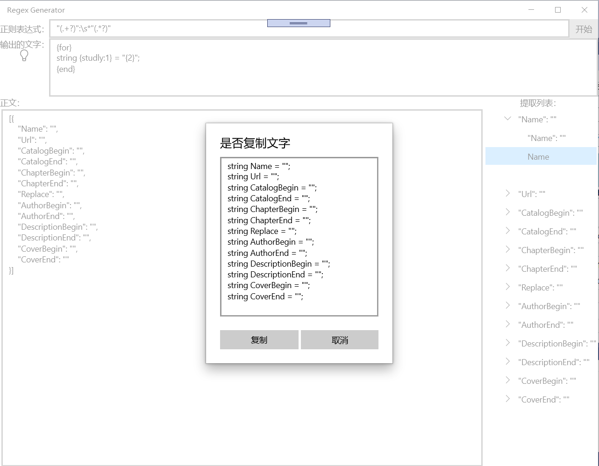
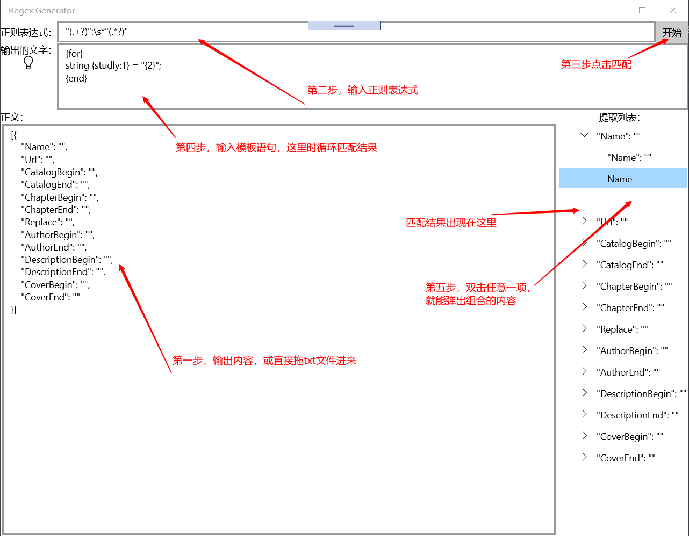

# WPF-Regex
正则提取
说明
=======
    
1. 增加匹配列的显示

2. 修改简单语法

    1. {} 直接输出 默认为 0， 可以 int   可以用 . 连接使用第二级的内容
    2. for 语句
        {for} 或 {~} 开始标志 

        for 无参数时，表示循环输出全部

        for:n 一个参数时，表示从0 开始 共输出 n 个

        for:m, 第二个参数缺省时，表示从m 开始，输出后面所有的

        for:m,n 两个参数时，表示从 m 开始，共输出 n 个

    循环体 {} 只能是 int 或 标签 ，不再支持 . 连接，暂不支持 for 循环

    {index:} 输出当前m的值

    {end} 或 {!} 结束标志

    3. 整数循环
        {1 2 ... 7}  开始标志

        {1 ... 7}  从1循环到7 即输出 1 2 3 4 5 6 7

        {1,3 ... 7} 从1循环到7 每个数隔2 , 即 1 3 5 7

        {16:1 2 ... 15} 从1循环到15的十六进制 即输出 1 2 ... F
    
    4. 数组循环
        {aa,bb,cc} 开始标志，以英文逗号分隔
    

    {}           取值标志

    {end} 或者 {!} 结束标志
    
    整数循环 和 数组循环 中循环体 {1} 这种方式取值表示全局的值 {index:} 输出当前顺序值

    5. {m~n} 输出 m到n 的随机数
    
    6. 新增驼峰与下划线转换
        {studly:}    “ ”、“_”、“-” 为分割符，包括首字母转大写成驼峰写法例如 aa_aa 转成 AaAa

        {lstudly:}   首字母为小写的驼峰写法 例如 aa_aa 转成 aaAa
        
        {unstudly:}  驼峰写法转下划线 例如 AaAa 转成 aa_aa

    7. {+7:}  以加号和数组组成的方法为 前置补0，补齐多少位

    8. 支持注释 // 或 /* */ 不进行输出

4. 支持文本文件拖拽

5. 提取整理算法

6. 增加 UWP 版

7. 增加数字循环中的格式化和进制转化， 默认为十进制

8. 新增驼峰与下划线转换

9. 统一WPF、UWP 版样式

## 构思来源
-------

	1. 用作正则表达式的练习
	2. 快速提取网页中的内容，并生成新的网页
	
## 最后更新时间：2020/07/24